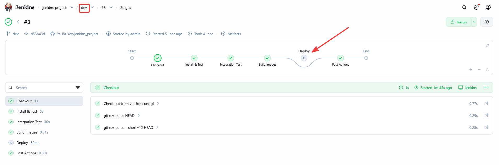
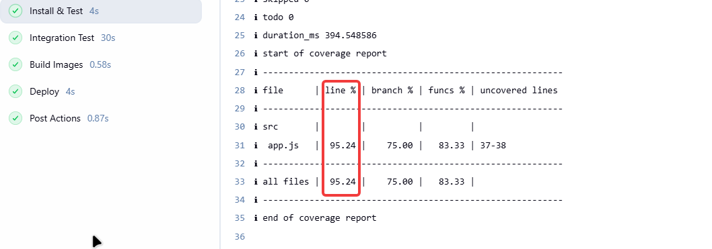
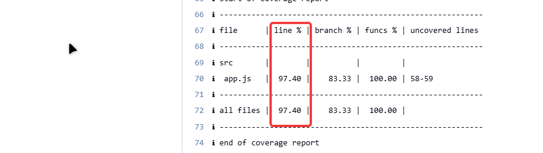
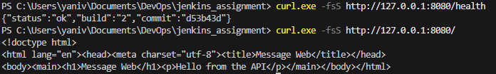
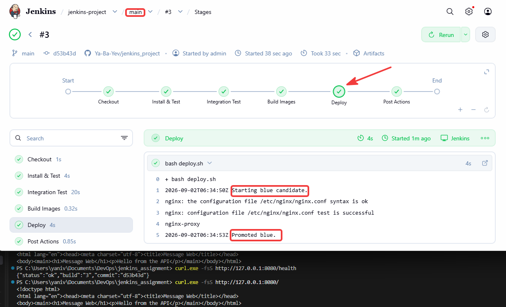
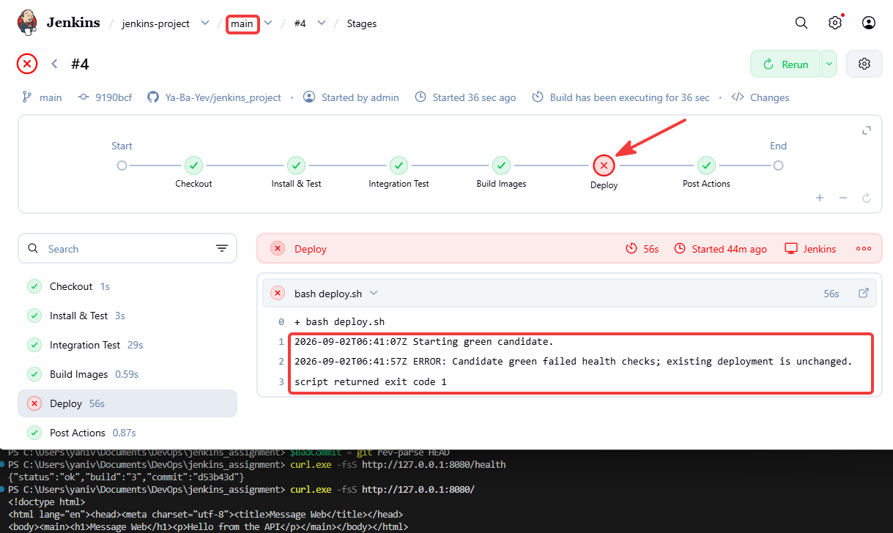
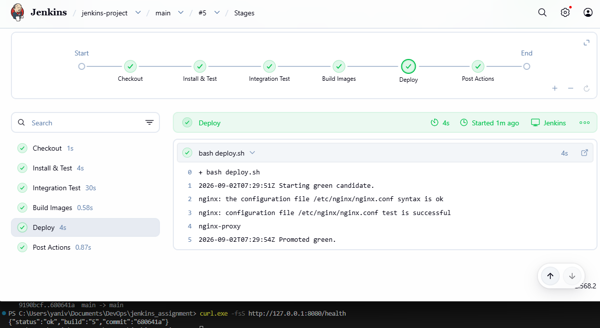
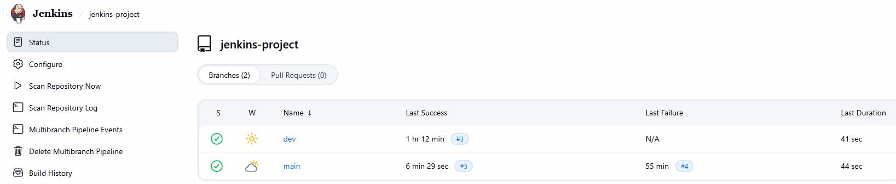
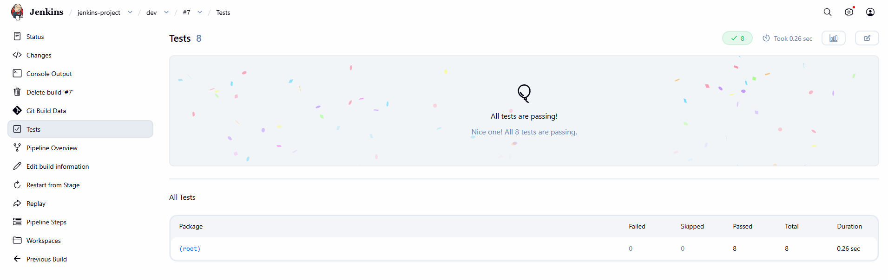
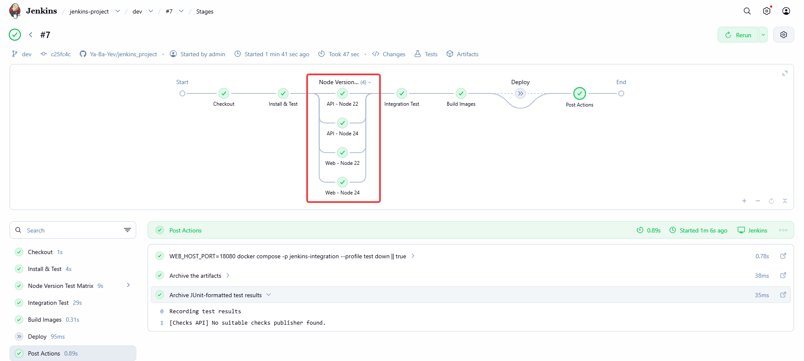

# Jenkins Two-Service CI/CD Project

A compact CI/CD project for two independent Node.js/Express services: a JSON
message API and a server-rendered web application that displays the API
message. Docker isolates the services, Jenkins verifies every branch, and the
`main` branch uses a blue-green deployment behind a stable Nginx entry point.

## Local two-service architecture

The web service is the only local host-facing application. It resolves `api`
over the Compose application network; the API is not published directly to the
host. An integration-test container exercises the same web-to-API path.

```text
                         Docker Compose application network
┌──────────────┐        ┌──────────────────┐        ┌──────────────────┐
│ Host browser │───────▶│ web              │───────▶│ api              │
│ localhost:   │ :8080  │ renders HTML     │ :3000  │ GET /api/message │
│ 8080         │        │ GET /health      │        │ GET /health      │
└──────────────┘        └──────────────────┘        └──────────────────┘
                                  ▲
                                  │ separate edge network
                         ┌────────┴─────────┐
                         │ integration test │
                         │ verifies HTML    │
                         └──────────────────┘
```

## Jenkins delivery flow

Both branches run the same verification and image-build stages. `dev` stops
after CI; `main` continues to deployment. Coverage is collected per service
with an 80% line-coverage threshold; the native Node.js test runner keeps its
human-readable console output while writing LCOV artifacts and JUnit XML
(`coverage/junit.xml`) for Jenkins test-result publishing. After the coverage
gate, a bonus matrix runs each service's standard tests on both Node.js 22 and
Node.js 24 Docker images. The matrix is additional compatibility evidence; it
does not replace the Node.js 24 coverage gate on the Jenkins agent.

```text
dev  ──▶ Checkout ──▶ Install & Test ──▶ Node Version Test Matrix ──▶ Integration Test ──▶ Build Images ──▶ CI complete

main ──▶ Checkout ──▶ Install & Test ──▶ Node Version Test Matrix ──▶ Integration Test ──▶ Build Images ──▶ Deploy ──▶ Live
                                                                                                   │
                                                                                                   └── deploy stage runs only on main
```

## Blue-green deployment flow

Nginx remains the fixed public entry point on port 8080. Each color is a
matched API/web pair on the blue-green network, and a web container calls only
its same-color API. A candidate is promoted only after API and web health JSON
responses each report `status: "ok"`, the exact Jenkins build number, and the
first seven characters of the exact Jenkins commit. Rendered-content and Nginx
configuration checks must also succeed.

```text
                                ┌──────────────────────────────────────────┐
Client ──▶ :8080 ──▶ Nginx ───▶│ active upstream: web-blue ─▶ api-blue     │
                                └──────────────────────────────────────────┘
                                              │
                                              │ start inactive candidate
                                              ▼
                                ┌──────────────────────────────────────────┐
                                │ candidate: web-green ─────▶ api-green     │
                                │ JSON health metadata + rendered page      │
                                └──────────────────────────────────────────┘
                                              │
                         checks pass          │          any check fails
                              ▼               │               ▼
Nginx config test + graceful reload ──▶ route to green     remove green; blue stays live
                              │
                        reload fails
                              ▼
               restore blue upstream where possible; remove candidate; fail deploy
                              │
                        reload succeeds
                              ▼
                    remove old blue pair; green is active
```

## Evidence

| Evidence | Screenshot |
| --- | --- |
| `dev` pipeline: Deploy is skipped while CI stages succeed. |  |
| API coverage report. |  |
| Web coverage report. |  |
| Endpoint replay: initial live endpoint evidence from build 2, showing the public health and rendered-page responses. |  |
| Successful `main` blue deployment (build 3): the blue candidate is promoted and the public health/page responses are shown. |  |
| Failed `main` candidate/rollback (build 4): Jenkins reports failed health checks and leaves the existing deployment unchanged. |  |
| Successful `main` green deployment (build 5): the green candidate is promoted after health checks. |  |
| Multibranch dashboard: `dev` and `main` branch histories. |  |
| Bonus: Jenkins test report showing all 8 tests passing. |  |
| Bonus: parallel Node.js 22 and Node.js 24 test matrix. |  |

## Technologies

Node.js 24, Express, Docker, Docker Compose, Nginx, Jenkins Multibranch
Pipeline, Bash, and native Node.js test coverage.

## Personal Reflection

The most challenging part of this project for me was implementing the
blue-green deployment. I learned to keep Nginx fixed on port 8080, start a
candidate version first, and health-check it before switching traffic to it.
During the work, I also encountered a port collision between Compose and
Nginx, which taught me the importance of distinguishing between local
development/testing ports and Nginx's fixed ingress port. If the candidate
fails its checks, it is removed while the previous version remains live and
available to users.
